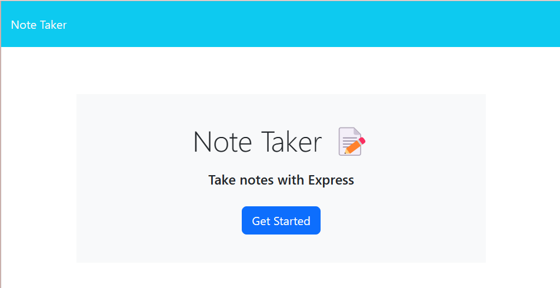
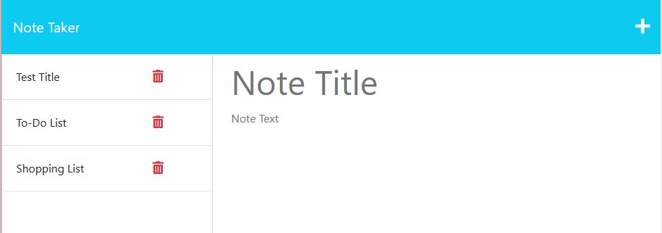

# Write Now

## Description

This is a simple note-taking application that allows users to create, save, view and delete notes. The application is built with Node.js and Express.js, and it stores the notes in a JSON file.

Installation
To install and run the application, follow these steps:

1. Clone this repository to your local machine.
2. Open a terminal and navigate to the root directory of the application.
3. Run npm install to install the required dependencies.
4. Run node server.js to start the server.
5. Open your web browser and navigate to http://localhost:3000 to access the application.

## Usage
To use the Note Taker application, follow these steps:

View Deployed Site: https://writenow.herokuapp.com/

1. Click on the "Get Started" button on the home page to go to the notes page.
   

2. To create a new note, click on the pencil icon in the top-right corner.

3. Enter a title and text for your note, then click the save icon in the top-right corner.
4. Your note will now appear in the list of notes on the left side of the page.
5. To view a note, click on its title in the list.
6. To delete a note, click on the trash can icon next to its title in the list.

## License
This application is licensed under the MIT license. See LICENSE for more information.

## Contact-Me
I hope you find the Write Now app useful and enjoyable. If you encounter any issues or have any feedback, please don't hesitate to reach out to me.

Name - Ashlee Huff
Email - huff.n.ashlee@gmail.com
Github - https://github.com/ash12486/